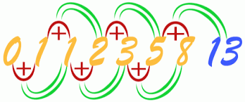
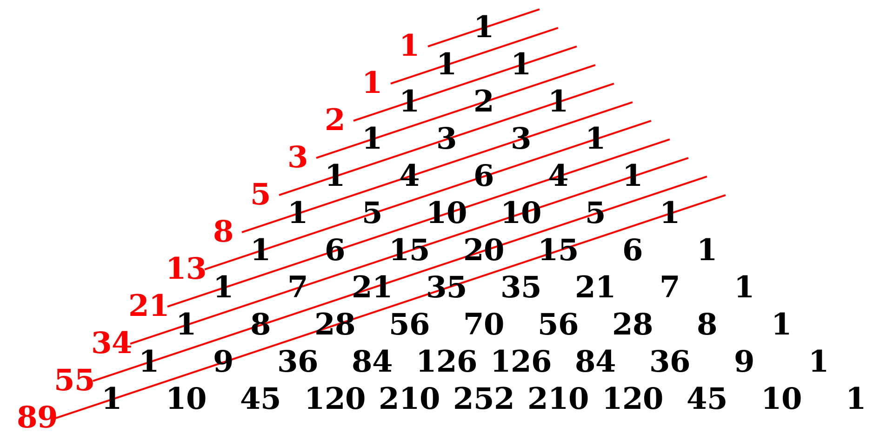

# Numero Fibonaci

Em matemática, os números de Fibonacci , comumente denotados por F n , formam uma sequência , chamada de sequência de Fibonacci , de forma que cada número é a soma dos dois precedentes, começando em 0 e 1.
<p align="center"><a href="https://github.com/lucenarenato/Ecommerce_livros_Laravel-6" target="_blank"></a></p>

# Fibonacci series of given number in PHP
## php-fibonacci-sequence
> Até Hoje apanho com funçôes recursivas, vamos la no artigo abaixo.
> A série de Fibonacci é uma série de números em que o próximo número é encontrado pela soma dos 2 anteriores da série.
> Aqui estão os primeiros dígitos da série:
### 0, 1, 1, 2, 3, 5, 8, 13, 21, 34, 55,….

Produzir a série em PHP é direto - e frequentemente uma questão de entrevista. Vamos codificar um agora!
Começamos codificando uma função que retorna o enésimo número na série:

```php
function fib($n){
    return fib($n-1) + fib($n-2);
}
```
Observe que essa função chama a si mesma. Isso é chamado de função recursiva .
Funções recursivas são muito poderosas (uma pequena quantidade de código produz ótimos resultados), mas podem levar a loops infinitos com muita facilidade. Normalmente, as funções recursivas são usadas para coisas como iterar em árvores ou onde há algum tipo de relacionamento pai-filho.
Você notará que o que fizemos ainda não funciona, pois não há um ponto de partida. Se passássemos fib (2), a função procuraria fib (0) e fib (1) - que nunca são calculadas.
Vamos resolver isso agora:
```php
function fib($n){
    if($n<2) return $n;
    return fib($n-1) + fib($n-2);
}
```
Aqui vamos nós! Se passarmos um “2”, obtemos calculando a fib (1) e a fib (0) - o que funciona!
As funções recursivas podem ser difíceis de entender - então sinta-se à vontade para rastrear o que cada parte da função está fazendo. Depois de fazer isso algumas vezes, eles virão naturalmente para você.
Agora, para chamar as funções para realmente imprimir a série, escrevemos um loop de invólucro:

```php
for($i=0;$i<11;$i++){
    echo fib($i) . " ";
}
```
## Vamos juntar tudo em um script:

```php
function fib($n){
    if($n<2) return $n;
    return fib($n-1) + fib($n-2);
}
for($i=0;$i<11;$i++){
    echo fib($i) . " ";
}
```
Isso produz:
> 0 1 1 2 3 5 8 13 21 34 55

> função do tipo O ^ n. Isso significa que, à medida que n fica grande, todas as coisas demoram cada vez mais para serem calculadas.

<p align="center"><a href="https://github.com/lucenarenato/Ecommerce_livros_Laravel-6" target="_blank"></a></p>

> Uma página do Liber Abaci de Fibonacci da Biblioteca Nazionale di Firenze mostrando (no quadro) a sequência de Fibonacci com a posição na sequência marcada em algarismos latinos e romanos e o valor em algarismos hindu-arábicos.
- Liber_abbaci_magliab_f124r.jpg
<p align="center"><a href="https://github.com/lucenarenato/Ecommerce_livros_Laravel-6" target="_blank"></a></p>


# Exemplos codigo github

`php -S localhost:8001`

- http://www.phponwebsites.com/2015/06/php-fibonacci-series-of-given-number.html
- https://www.sitesbay.com/php-program/php-fibonacci-series-program-in-php
- Otima fonte em ingles: https://en.wikipedia.org/wiki/Fibonacci_number

## Renato Lucena 2020